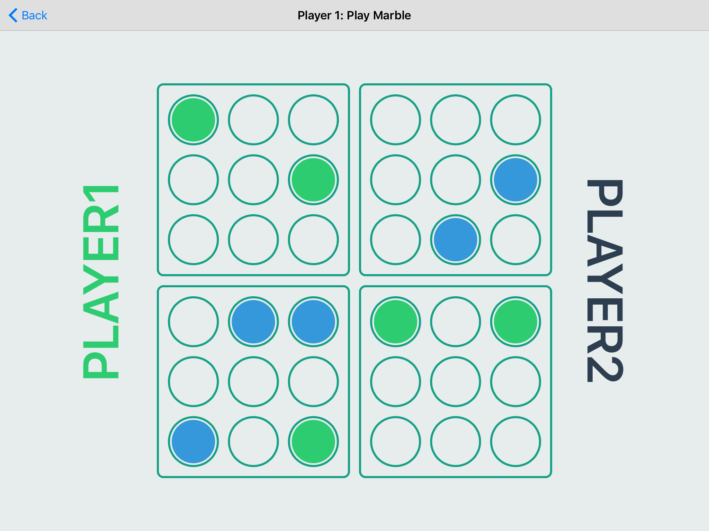

# Pentago
Pentago is a two-player strategy game where players take turns trying to outsmart their opponents by placing marbles on strategic locations on the game board.

Every turn, one player gets to place a marble of their color somewhere on the board, and then must rotate one of the board quadrants 90 degrees clockwise or counterclockwise. A player wins when they've made a straight chain of marbles of length 5 or more.
